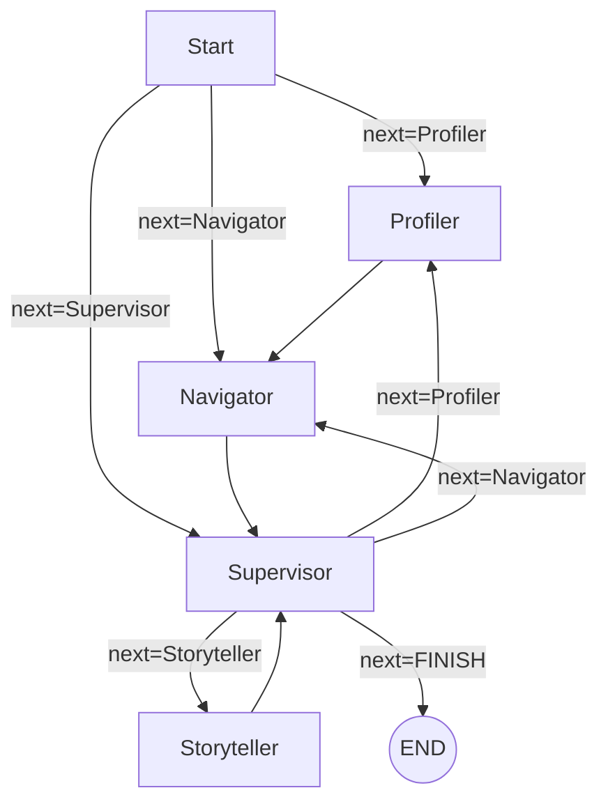

# bakend（Beijing Tour Guide Agent / LangGraph 后端）

本目录提供一个基于 **FastAPI + LangGraph + Tongyi(Qwen)** 的“北京导览智能体”后端服务。

- FastAPI 提供 HTTP 接口：`POST /api/plan`
- LangGraph 负责多智能体协作编排：Profiler → Navigator → Storyteller（由 Supervisor 路由）
- 通过 RAG（`rag_service`）为讲解生成提供事实依据

---

## 1. 目录结构

```text
bakend/
├── main.py                  # FastAPI 入口：POST /api/plan，调用 app_graph
├── requirements.txt         # 后端依赖
├── .env                     # 环境变量（API Key、模型名等）
├── app/
│   ├── graph.py             # LangGraph：定义节点、路由与边，并 compile 成 app_graph
│   ├── state.py             # AgentState / UserProfile / RoutePlan 数据结构
│   ├── agents/
│   │   ├── profiler.py      # Profiler：从用户输入提取兴趣标签（selected_themes）
│   │   ├── navigator.py     # Navigator：选点 + 路线排序 + AMap 路由
│   │   └── storyteller.py   # Storyteller：基于 RAG 上下文生成导游讲解
│   └── services/
│       ├── map_service.py   # 地图服务（AMap 路由）
│       ├── mock_db.py       # POI 样例数据/筛选/排序逻辑
│       └── rag_service.py   # 检索服务：为讲解提供事实上下文
├── scripts/
│   └── seed_data.py         # 示例：初始化/写入一些数据（如有）
└── storage/                 # 本地存储（docstore/index/vector_store 等）
```

> 说明：目录里还包含一些 `*_test.json`、`test_*.py` 用于本地测试与调试。

---

## 2. Graph 结构（LangGraph）

后端的核心编排在 `app/graph.py`，节点与路由关系如下：

- **Start**：根据 `user_profile` 或输入形态决定下一步
- **Profiler**：补全/提取用户兴趣标签（Interests）
- **Navigator**：选择 POI、确定出行方式并生成路线 `RoutePlan`
- **Storyteller**：对路线中的景点进行讲解（结合 RAG 上下文）
- **Supervisor**：负责决定下一步该由哪个节点继续，或结束

### Graph 图（Mermaid）



---

## 3. API 说明

### POST `/api/plan`

- 文件：`main.py`
- 输入：JSON
- 输出：
  - `response`: 最终给用户的导览/路线/讲解文本
  - `run_id`:（可选）LangChain tracer 的 run id

请求体（`PlanRequest`）字段：

- `selected_themes`: list[str]，用户选择的主题（如：历史、美食、亲子）
- `time_budget`: string，时间预算（如：half_day/full_day 等）
- `mbti`: string | null，MBTI（可选）
- `transportation`: string，walking/driving/auto
- `user_text_input`: string，额外补充的自然语言诉求
- `selected_route_name`: string | null，可选参考路线名
- `pace_preference`: string，slow/medium/fast

---

## 4. 环境变量（.env）

`main.py` 会加载 `.env`（`python-dotenv`）。常用配置：

- `DASHSCOPE_API_KEY`：通义 DashScope Key
- `LLM_MODEL_NAME`：如 `qwen-plus`
- （如果 `map_service` 需要）高德 Key 相关环境变量（以 `app/services/map_service.py` 为准）

---

## 5. 启动方式

1) 安装依赖（建议在虚拟环境中）：

- `pip install -r requirements.txt`

2) 启动服务：

- `python main.py`

服务默认监听：`http://0.0.0.0:8000`

---

## 6. 备注与限制

- 当前 Graph 的“进度/中间状态”主要体现在 LangGraph 的内部状态推进；HTTP 接口只返回最终文本。
- `storage/` 目录保存本地索引/向量库等文件，部署时请考虑持久化策略。
- 如需扩展更多 Agent（例如：餐厅推荐、交通实时信息），建议：
  1) 在 `app/agents/` 新增节点实现
  2) 在 `app/graph.py` 增加 node 与 edge
  3) 在 `AgentState` 中补充必要字段
python3 -m